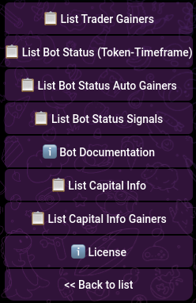

# List Menu

# Menu Options Explanation

This section describes the options available in the menu interface of the application. Each option provides access to specific features or information that assists users in managing and monitoring their trading bots and related activities.

## Menu Options

### 1. **List Trader Gainers**

This option allows users to view a list of the top-performing traders. It is useful for identifying successful trading strategies or individuals that can be followed or analyzed for insights.

### 2. **List Bot Status (Token-Timeframe)**

Select this option to view the status of bots based on specific tokens and timeframes. This feature is essential for monitoring the performance of bots under different market conditions and across various time intervals.

### 3. **List Bot Status Auto Gainers**

This menu option provides a list of bots that have automatically gained in value. It helps users track which bots are currently outperforming others without manual intervention.

### 4. **List Bot Status Signals**

Use this option to view the status of bots based on the signals they generate. It helps in understanding how bots are responding to market signals and making decisions accordingly.

### 5. **Bot Documentation**

This section provides detailed documentation for the bots. It is a valuable resource for users who need in-depth information about how each bot operates, including setup, configuration, and troubleshooting.

### 6. **List Capital Info**

This option allows users to view detailed information about their capital. It helps in understanding how much capital is currently being used, how it is distributed, and its overall performance.

### 7. **List Capital Info Gainers**

Select this option to view information about the capital that has gained value. It is useful for monitoring which parts of the user's capital are performing well.

### 8. **License**

This section provides information about the licensing of the software. It is essential for users to understand the terms and conditions under which they are using the application.

### 9. **Back to List**

This option returns the user to the previous menu or list. It is useful for navigating back after viewing detailed information or submenus.

---

These menu options are designed to help users efficiently manage and monitor their trading activities, ensuring they have access to all necessary information and tools within the application.
