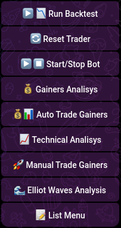

# Start / Stop Signals

### Start / Stop Signals

To start or stop the signals, it will ask for:

- Select the Start or Stop option from the button list. When you select Stop, the bot will halt the current operation. When you select Start, the bot will initiate live trading. If this is the first time executing a trade, the bot will also prompt you to enter your initial capital to store it in the database.
- Check from the list menu, to view the bot status.